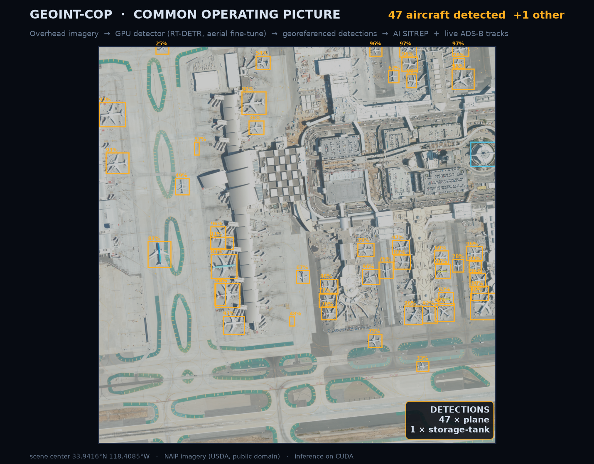

# GEOINT-COP — Geospatial Intelligence Common Operating Picture

A fused common operating picture: **live air tracks** from a public ADS-B feed and
**object detections from overhead imagery**, on one map, with an automatically
generated SITREP.



*Output of an earlier version, which ran an Ultralytics oriented-box model
trained on DOTA aerial imagery over the bundled public-domain NAIP scene of LAX.
That model and the script that drew this image were removed when the project
moved off Ultralytics. The current default detector learned from everyday photos
(COCO), so it doesn't pick out aircraft in an overhead scene like this one;
getting that back means fine-tuning it on aerial imagery (see Roadmap).*

The vision pipeline is split on purpose:

- **Precise object counts → a real detector on GPU.** RT-DETR, loaded through
  Hugging Face Transformers, runs on the RTX 3080 (CUDA) and produces bounding
  boxes and counts, which general vision models can't do reliably. Any
  Transformers object-detection checkpoint can stand in via `DETECTOR_MODEL`.
- **Everything else → OpenAI.** GPT vision writes a qualitative scene assessment of
  the image, and a second call fuses the detector's counts with that assessment into
  a SITREP.

> In a deployment the OpenAI calls swap for a local model (e.g. Ollama) so
> no imagery leaves the enclave. `backend/reporting.py` is the only thing that changes.

## Architecture

| Component     | Path                   | Role                                              |
| ------------- | ---------------------- | ------------------------------------------------- |
| Detection     | `backend/detection.py` | RT-DETR via Transformers (CUDA) + rasterio georef |
| Reporting     | `backend/reporting.py` | OpenAI scene assessment + SITREP                  |
| Live tracking | `backend/tracking.py`  | OpenSky poller → WebSocket broadcast              |
| Storage       | `backend/db.py`        | PostGIS (SQLite fallback)                         |
| API           | `backend/main.py`      | `/api/detect`, `/ws/tracks`, `/healthz`, `/metrics` |
| Map UI        | `frontend/`            | Leaflet ops console                               |

## Quick start (light — live map only)

```bash
pip install -r requirements.txt
cp .env.example .env          # optional: add OpenSky creds for a denser feed
uvicorn backend.main:app --reload
# open http://localhost:8000
```

Runs the live aircraft map immediately (SQLite fallback, no detector needed).

## Enable imagery detection (GPU box)

```bash
pip install -r requirements-ml.txt   # transformers + torch + rasterio
# add your OpenAI key to .env
```

Upload an overhead image in the UI. Georeferenced GeoTIFFs plot detections on the map;
plain image chips still get counts + a SITREP.

## Full stack (PostGIS, containerized)

```bash
docker compose up --build
```

## Configuration

See `.env.example`. Key vars: `OPENAI_API_KEY`, `OPENSKY_CLIENT_ID/SECRET`,
`TRACK_BBOX`, `DETECTOR_MODEL` (with `DETECTOR_REVISION`, the commit it's pinned
to), `DATABASE_URL`.

## Roadmap

- [x] Live ADS-B map (OpenSky → WebSocket → Leaflet)
- [x] GPU detection endpoint + georeferencing
- [x] OpenAI scene assessment + SITREP
- [x] PostGIS storage, Docker, CI with security gates
- [ ] Deploy (API/track/UI tier is GPU-free; detection maps to a GPU node)
- [ ] AuthN/Z (currently open — see Security below)
- [ ] AIS (maritime) feed as a second track source
- [ ] Local-model reporting backend (Ollama) for offline use
- [ ] Aerial detector: fine-tune RT-DETR on overhead imagery (the default model
      learned from everyday photos and misses aircraft seen from above)

## Security & Compliance

Structured to map onto a subset of NIST SP 800-53 controls. Items marked _(planned)_
are intentionally not yet implemented.

| Control                  | Implementation                                                  |
| ------------------------ | --------------------------------------------------------------- |
| AC-6 (least privilege)   | Container runs as non-root `appuser`; least-privilege DB user   |
| AU-2/AU-3 (audit)        | Structured logging of access + detections _(expand — planned)_  |
| CM-6 (config settings)   | Pinned slim base image, minimal packages, no shell extras       |
| RA-5 (vuln scanning)     | Trivy image scan in CI (fails on HIGH/CRITICAL)                 |
| SA-11 (developer testing)| Bandit SAST + pytest in CI                                      |
| SI-2 (flaw remediation)  | `pip-audit` dependency scan in CI                               |
| SC-8 (transmission)      | TLS terminated at ingress/proxy _(planned — not in compose)_    |
| SC-28 (data at rest)     | DB creds via env/secrets; host volume encryption _(planned)_    |

**Zero Trust posture:** no implicit network trust between services; API and DB are
isolated on the compose network with a scoped DB user. Per-request authentication is
_(planned)_ — today the API is open and intended for local/demo use.

**STIG-aligned hardening:** non-root runtime, slim base, dependency pinning, image
vulnerability gate. Run a container STIG/CIS benchmark scan before any real deployment.

## License

Everything in this repository from this change on is under the
[PolyForm Noncommercial License 1.0.0](LICENSE). Earlier commits were released
under the GNU Affero General Public License v3.0 and stay under it. In plain terms: it is free for
any noncommercial purpose, and for schools and universities, public research
organizations, government institutions and charities, whatever their funding.
Commercial use needs a license from the author: ask through
[the issue tracker](https://github.com/MichaelFowler1/Geoint/issues). Anyone who
passes on a copy has to pass on the license and the `Required Notice:` line in
[NOTICE](NOTICE). This is a plain summary; the LICENSE file is what governs.
